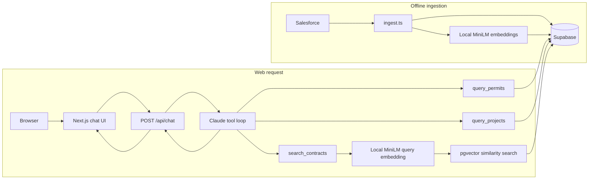

# Construction Q&A Agent

A grounded question-answering application for construction permits, projects, and contracts. Salesforce is the source system, Supabase is the query-time data store, Claude routes questions through typed tools, and contract search uses local MiniLM embeddings.

Production: <https://construction-agent-alpha.vercel.app>

## Architecture



Salesforce is not queried when a user asks a question. `ingest.ts` mirrors source records into Supabase ahead of time. This keeps runtime requests fast, avoids Salesforce API limits, and gives structured queries exact counts and totals.

## Request flow

1. [`app/page.tsx`](app/page.tsx) sends the question and bounded conversation history to `/api/chat`.
2. [`app/api/chat/route.ts`](app/api/chat/route.ts) validates the request and calls the agent.
3. [`lib/agent.ts`](lib/agent.ts) asks Claude to choose one or more tools. Claude does not receive direct database access.
4. [`lib/tools.ts`](lib/tools.ts) runs the selected query against Supabase.
5. Permit and project questions use structured filters and exact aggregates.
6. Contract questions are embedded by [`lib/embed.ts`](lib/embed.ts) and matched against stored 384-dimensional vectors through pgvector.
7. Claude writes the answer from tool results. The API separately converts successful tool results into bounded evidence groups.
8. The UI renders the answer as safe Markdown and shows filters, aggregates, and supporting records under **Sources & evidence**.

The evidence panel comes from tool output, not from claims generated in the answer. This makes counts and source records independently inspectable.

## Project map

| Path | Responsibility |
|---|---|
| `app/page.tsx` | Browser chat state, Markdown answers, and evidence display |
| `app/api/chat/route.ts` | Runtime request validation and public evidence shaping |
| `lib/agent.ts` | Claude system rules and tool-use loop |
| `lib/tools.ts` | Exact permit/project queries and contract vector search |
| `lib/embed.ts` | Shared MiniLM embedding model for ingest and query time |
| `lib/db.ts` | Server-only Supabase client |
| `ingest.ts` | Salesforce-to-Supabase mirror and contract embedding |
| `supabase-schema.sql` | Tables, pgvector function, and row-level security |
| `eval/questions.json` | Frozen regression questions and expected facts |
| `eval/run.ts` | Terminal evaluation runner |
| `test.ts` | One-question terminal agent runner |
| `.vercelignore` | Excludes local secrets, caches, and generated files from deployments |

## Why the tools differ

Permit counts and project budgets are structured facts. SQL-style filtering returns exact values, so the model never estimates or sums retrieved prose.

Contract clauses are long text and users can phrase the same concept many ways. Semantic search retrieves likely contract candidates, after which Claude must confirm that the returned contract text satisfies every location, party, and contract constraint.

The same `Xenova/all-MiniLM-L6-v2` model creates stored contract vectors during ingestion and query vectors at runtime. Mixing embedding models would make similarity scores invalid.

## Data and security boundaries

- Current mirror: 15 projects, 418 permits, and 100 contracts.
- Supabase row-level security is enabled on all three tables.
- The Supabase server key and Anthropic key are available only to server-side code.
- The browser calls `/api/chat`; it never receives database or provider credentials.
- `.env`, `.env.local`, model caches, and Vercel metadata are excluded from Git.
- `.vercelignore` separately prevents local secret files and caches from entering CLI deployment uploads.
- Salesforce credentials are needed only for ingestion and are not configured in Vercel.

## Local commands

From `C:\Users\udayr\Downloads\Construction Agent`:

```powershell
npm run dev
```

Open <http://localhost:3000>.

```powershell
npm run typecheck
npm run build
npm run agent -- "How many permits are in Seattle?"
npm run eval
```

Run ingestion only when Salesforce source data should be mirrored again:

```powershell
npm run ingest
```

Prepare the local Phase 6 invoice sample and test one image with Claude Vision:

```powershell
npm run invoice:sample
npm run invoice:vision
```

The sample command audits the downloaded ZIP and extracts 20 deterministic annotated image pairs into the Git-ignored `data/invoice-sample` directory. The vision command extracts one invoice and compares reliable fields with the dataset ground truth.

## Verification strategy

The regression suite covers permits, projects, contract terms, and unavailable-data questions. Exact expected facts include:

- Seattle: 209 permits, including 37 records with no status.
- San Francisco: 7 projects totaling $34,440,000.
- All projects: 15 projects totaling $74,590,000.
- Rainier Elevator Subcontract #1022: Net 45 payment, 10% retainage, and a 12-month warranty.
- Chicago elevator and Austin permit questions must return unavailable-data responses.

After changing tools, prompts, embeddings, or data, run the relevant targeted case and then the complete suite.

## Deployment

The Vercel runtime needs:

- `SUPABASE_URL`
- `SUPABASE_SECRET_KEY`
- `ANTHROPIC_API_KEY`

Permit and project requests do not load the embedding model. The first contract request in a new serverless instance downloads and initializes MiniLM in Vercel's writable temporary directory. A production cold-start test completed in about nine seconds. Warm instances reuse the in-process model, while a new instance downloads it again.

## Current scope

The core permit, project, and contract MVP is deployed. Phase 6 data preparation found 1,414 valid annotated image pairs among 1,489 Batch 1 images. The first Claude Vision smoke test passed all nine ground-truth comparisons. Purchase-order loading and line-item spend queries remain gated on a multi-invoice extraction evaluation.
